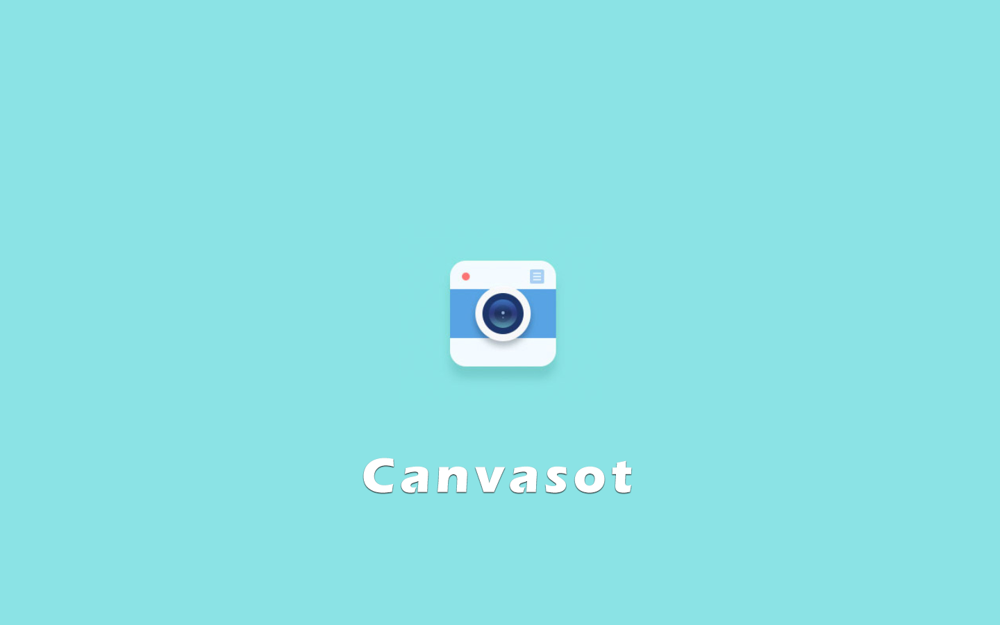
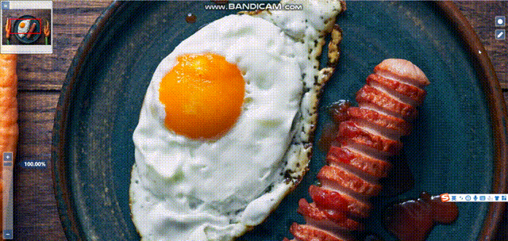

# Canvasot

😀

### 介绍

基于 html2canvas 编写的一个截图工具



### 演示



### 使用

在使用之前需要先导入[html2canvas](http://html2canvas.hertzen.com/)或者安装[html2canvas](http://html2canvas.hertzen.com/)，因为该插件依赖了[html2canvas](http://html2canvas.hertzen.com/)库


#### 引入

import

```js
// 因为没有发布到npm上，需要手动下载
// 需要先安装html2canvas
import Canvasot from 'Canvasot';
```

script

```html
<script src="html2canvas.js"></script>
<script src="Canvasot.min.js"></script>
```


#### 使用


**基本使用**

只要如下几个步骤就可以实现截图的功能，默认是截图后自动下载图片，如需要导出`base64`数据，需注册截图成功方法。

```js
// 实例化一个Canvasot对象，传入一个Dom截屏事件元素
let c = new Canvasot(document.getElementById('map'));
// 触发事件的按钮
const screenshotBtn = document.getElementById('screenshot');
// 触发Canvasot截屏事件
screenshotBtn.addEventListener('click', c.handleCaptrue.bind(c));
```


注册截图成功后方法

```js
// 实例化一个Canvasot对象，传入一个Dom截屏事件元素
let c = new Canvasot(document.getElementById('map'));
// 触发事件的按钮
const screenshotBtn = document.getElementById('screenshot');
// 触发Canvasot截屏事件
screenshotBtn.addEventListener('click', c.handleCaptrue.bind(c));
// 注册截图后方法
c.RegisterAfterCapture(function (err, data) {
	// data为base64格式
	if (err) {
		console.log(err);
		return;
	}
	console.log('截图成功');
	console.log(data);
});
```


### api

#### handleCaptrue(callbackfn?)

> 在激活截图事件时执行传入的 callbackfn

#### RegisterAfterCapture(callbackfn?)

> 在截图成功后执行传入的 callbackfn,默认行为下载所截的图


### 存在问题


自由拖拽截图框没有做出限制，会溢出到边缘。

所以加了一个截全屏的功能


### 感谢

因为开源，让我找到一个类似的功能。不过我已经找不到最初的网址在哪了。所以很感谢提供相应的源码的工程师。我只不过是一个搬运工，将其封装罢了。
